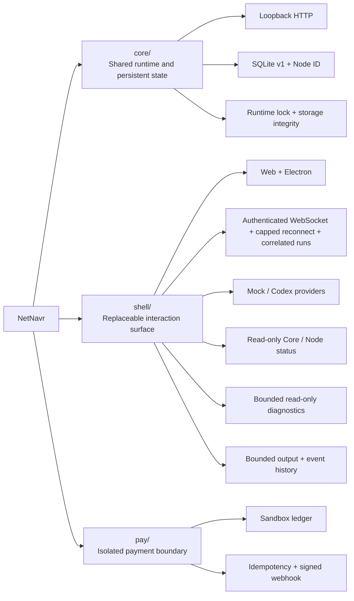

<div align="center">

# 🧭 NetNavr

[](#project-status)

**A user-owned continuity layer for personal AI**

**Keep identity, governed memory, permissions, and abilities under your control**

[](./LICENSE)
[](https://nodejs.org/)
[](https://www.typescriptlang.org/)
[](./shell)
[](#project-status)
[](https://github.com/PM100Fun/NetNavr/releases/latest)
[](https://github.com/PM100Fun/NetNavr/actions/workflows/ci.yml)
[](https://github.com/PM100Fun/NetNavr/stargazers)

**English** · **[简体中文](./README.zh-CN.md)**

**[Quick start](#quick-start)** · **[Capabilities](#capabilities)** · **[Architecture](#architecture)** · **[Roadmap](#roadmap)**

</div>

---

<a id="project-status"></a>

**NetNavr is an independent open-source, pre-alpha public lab. It is not a production agent platform or payment system.**

> ⚠️ This repository provides a runnable local engineering prototype for exploring personal-AI continuity. Do not use it with important data, real funds, untrusted networks, or production workloads.
>
> **Not yet delivered:** Navigator identity, governed memory, complete permission enforcement, provider-switch continuity, device pairing, backup and restore, or a public Ability security model.

Questions and feedback are welcome in [GitHub Issues](https://github.com/PM100Fun/NetNavr/issues). If the direction is useful, consider giving the project a Star.

---

<a id="positioning"></a>

## ✨ Why NetNavr

NetNavr is not trying to be one more chat window. It explores a continuity layer for personal AI: models, providers, devices, and interfaces may change, while the user's identity, governed memory, permissions, and installed abilities remain controllable, portable, and auditable.

| Principle | What it means |
| :--- | :--- |
| 🏠 **User ownership** | Persistent identity and data should live on infrastructure controlled by the user, not inside a single model provider. |
| 🔁 **Replaceable intelligence** | Models and providers are interchangeable sources of intelligence, not the sole owners of personal-AI state. |
| 🧠 **Governance first** | Memory needs provenance and confirmation state; automation needs explicit permission boundaries. |
| 🧩 **Composable abilities** | Tools, connectors, skills, and plugins should converge on a consistent Ability contract. |
| 🛡️ **High-risk isolation** | Payment-specific behavior stays outside the general runtime boundary. |

> [!IMPORTANT]
> The first product proof is continuity, not feature count: create identity and governed memory on a user-controlled Node, invoke one low-risk Ability through explicit permissions, switch the intelligence provider without losing state, then prove isolated backup and restore.

<a id="capabilities"></a>

## 🚧 Verified capabilities

The table below describes what can be inspected in the current source tree. Product goals that are not implemented are listed separately.

| Area | Responsibility | Current implementation | Status |
| :--- | :--- | :--- | :---: |
| [`core/`](./core) | Shared runtime, persistent state, and policy boundary | Loopback-only HTTP; SQLite schema v1; persistent Node ID; single-owner data directory; bounded read-only API contract | ✅ `v0.2.1` |
| [`shell/`](./shell) | Replaceable human interaction surface | Electron / React / TypeScript; bounded diagnostics, protocol envelopes, and Renderer state; authenticated loopback WebSocket lifecycle with capped reconnect; correlated run control; read-only Core and Node status; Mock and Codex routing | 🚧 Prototype |
| [`pay/`](./pay) | Payment behavior isolated from the general runtime | Bounded loopback HTTP; SQLite sandbox ledger; idempotent creation; sandbox channel; event-bound signed webhooks | 🧪 Sandbox only |

<details>
<summary><b>📦 Current implementation boundaries</b></summary>

### Core

- Creates a stable, non-secret Node ID for one local installation and persists it in SQLite.
- Exposes read-only checks through `GET /v1/health` and `GET /v1/node`.
- Adds a server-generated request ID to every response and includes it in structured error envelopes.
- Rejects request bodies, unsupported methods on known routes, and headers above the Core limit; applies bounded header, request, and keep-alive timeouts.
- Fails closed on database corruption, migration-history mismatch, a newer schema version, or an invalid Node ID.
- Acquires an exclusive runtime lock before opening the primary database.
- Preserves the database and Node ID after unexpected process termination.
- Applies restrictive data, database, sidecar, and lock-file permissions on POSIX systems.

### Shell

- Contains Web, Electron Desktop, local Agent Server, protocol, model-router, and Codex-client packages.
- Keeps workspace, sandbox, and approval policy under server control for local WebSocket sessions.
- Generates and shares a fresh local session token between the server and Web client when using `npm run dev`.
- Exposes `GET /health` and `GET /api/providers` as bounded read-only diagnostics with server-generated request IDs and structured errors; rejects request bodies, unsupported methods on known routes, and oversized headers.
- Accepts WebSocket upgrades only for the exact `GET /ws` target, caps simultaneous authenticated clients at four, correlates rejected upgrades with server-generated request IDs, and shuts down idempotently.
- Retries unexpected local WebSocket drops with one capped `250 ms` to `5 s` backoff timer, resets the backoff after a successful open, and cancels pending retries when the Renderer unmounts.
- Limits live Agent output state to `256,000` UTF-16 code units with a visible truncation marker, keeps only the newest `500` event rows, and assigns monotonic row IDs.
- Serializes outbound events through the shared protocol validator, removes upstream raw payload objects and unexpected fields, caps event text at `256,000` code units and diagnostics at `4,096`, and accepts only non-negative integer usage counters.
- Uses Shell protocol v3 with validated request and run IDs, attaches every run-scoped event to one run, remembers the most recent `512` accepted request IDs across authenticated connections for the current server process, rejects retained replays and overlapping starts, and only cancels the matching active run.
- Keeps the Renderer on the acknowledged run and ignores stale run-scoped events instead of letting an old completion or cancellation change current UI state.
- Starts the Electron-owned Agent Server on an OS-assigned loopback port and passes its ephemeral connection information through a context-isolated, sandboxed preload bridge instead of the renderer URL.
- Applies a restrictive renderer CSP and sends only credential-free HTTPS links to the operating system.
- Reads Core health, version, API version, and persistent Node ID through the trusted Electron bridge; the Renderer does not contact Core directly or retain an authoritative identity copy.
- Distinguishes offline, timeout, incompatible, HTTP, and invalid-response states while enforcing numeric loopback, a two-second total timeout, and a 16 KiB response ceiling.
- Remains a macOS-first interaction prototype; other desktop platforms are not release-qualified.

### Pay

- Provides a testable sandbox payment slice, not production payment infrastructure.
- Keeps payment behavior separate from Core's shared-runtime responsibilities.
- Accepts only the numeric loopback host `127.0.0.1` and defaults to port `8788`, separate from Shell.
- Bounds request headers and connection lifetimes, caps request bodies at 1 MiB, rejects bodies on bodyless routes, and returns no-store/nosniff JSON responses.
- Binds every webhook event ID to its original type, channel, and order; conflicting reuse fails closed.
- Validates order and signed webhook JSON types before business processing; malformed payloads return 422 without creating an order or applying a payment event.
- Rejects malformed URL encoding in order lookup IDs with 400; valid encoded IDs retain normal lookup behavior.

</details>

### Not implemented yet

**Navigator identity, governed memory, complete permission enforcement, provider-switch continuity, device pairing, backup and restore, and a public Ability manifest / sandbox / signing model remain in design or development.** A Node ID is only a local installation anchor; it is not a user identity or authentication credential. Shell still permits only one active run per local connection and does not persist run history.

<a id="architecture"></a>

## 🏗️ Architecture



| Layer | Current technology |
| :--- | :--- |
| **Core** | Node.js 24 · TypeScript · `node:http` · `node:sqlite` |
| **Shell** | Electron · React · Vite · TypeScript · WebSocket · OpenAI Codex SDK |
| **Pay** | Node.js 24 · SQLite · HMAC signing · pluggable Channel |
| **Quality gates** | `node:test` · TypeScript checks · GitHub Actions |

<a id="quick-start"></a>

## 🚀 Quick start

> Prerequisites: Node.js 24 or later and npm.

### 1. Clone and verify

```bash
git clone https://github.com/PM100Fun/NetNavr.git
cd NetNavr
npm --prefix shell ci
npm run verify
```

### 2. Start Core

```bash
npm run dev:core
```

Core listens only on `127.0.0.1:8786` by default. In another terminal:

```bash
curl http://127.0.0.1:8786/v1/health
curl http://127.0.0.1:8786/v1/node
```

The default database is `~/.netnavr/core/core.sqlite`. To use an isolated data directory:

```bash
# macOS / Linux
NETNAVR_CORE_DATA_DIR=/absolute/path/to/data npm run dev:core
```

```powershell
# Windows PowerShell
$env:NETNAVR_CORE_DATA_DIR = "C:\path\to\isolated-data"
npm run dev:core
```

### 3. Start Shell

```bash
npm --prefix shell run dev
```

This starts the local Agent Server and Web interface. When starting the server and Web client separately, provide the same fresh token to both sides as documented in [`shell/.env.example`](./shell/.env.example).

The standalone Web development interface intentionally has no direct Core access. On macOS, start the Electron Shell to use the trusted read-only Node Status bridge:

```bash
npm --prefix shell run dev:mac
```

Start Core first. Node Status displays Core/API versions, schema, uptime, the persistent Node ID, and its creation time without reading `core.sqlite`.

### 4. Optional: start the Pay sandbox

Pay defaults to `127.0.0.1:8788`, so it can run alongside Shell without a port override:

```bash
npm --prefix pay start
```

> [!CAUTION]
> The current development endpoints do not provide a complete application-level authentication and authorization system. Do not expose Core, Shell, or Pay to the public internet.

## ⚙️ Configuration

| Component | Variable | Default | Purpose |
| :--- | :--- | :--- | :--- |
| Core | `NETNAVR_CORE_PORT` | `8786` | Core loopback port; the Electron Node Status bridge consumes the same validated value |
| Core | `NETNAVR_CORE_DATA_DIR` | `~/.netnavr/core` | Core data directory |
| Shell | `PORT` | `8787` | Standalone development Agent Server port; Electron uses an OS-assigned port |
| Shell | `VITE_NETNAVR_SHELL_WS` | `ws://127.0.0.1:8787/ws` | Standalone development Web client WebSocket URL |
| Pay | `NETNAVR_PAY_HOST` | `127.0.0.1` | Fixed numeric loopback host; other values are rejected |
| Pay | `NETNAVR_PAY_PORT` | `8788` | Pay sandbox port |
| Pay | `NETNAVR_PAY_DB_PATH` | `./data/netnavr-pay.sqlite` | Pay sandbox database |

See [`shell/.env.example`](./shell/.env.example) and [`pay/.env.example`](./pay/.env.example) for the current examples.

<a id="roadmap"></a>

## 🗺️ Continuity roadmap

| Stage | Proof target | Status |
| :--- | :--- | :---: |
| **Local foundation** | Loopback Core, SQLite v1, persistent Node ID, single-owner storage, restrictive file permissions, bounded read-only HTTP | ✅ Verified |
| **Interaction prototype** | Web / Electron Shell, bounded diagnostics and Renderer output/history, authenticated WebSocket lifecycle with capped reconnect, correlated single-run control, read-only Core / Node status, Mock / Codex provider routing | 🚧 Prototype |
| **Identity and memory** | Navigator identity plus governed memory with provenance and confirmation state | ⏭️ Next |
| **Ability boundary** | One low-risk Ability with explicit permissions and structured results | ⬜ Not complete |
| **Continuity proof** | Switch providers without losing identity or confirmed memory | ⬜ Not complete |
| **Recoverability** | Isolated backup, restore, and device pairing | ⬜ Not complete |
| **Open ecosystem** | Ability manifest, sandboxing, signing, and third-party compatibility contract | ⬜ In design |

The roadmap describes validation order, not promised release dates.

## 🤝 Contributing

NetNavr currently benefits most from reproducible bug reports, small focused experiments, and critical review of its user-ownership and portability model.

- Read [CONTRIBUTING.md](./CONTRIBUTING.md) before submitting code.
- See [GOVERNANCE.md](./GOVERNANCE.md) for project governance.
- Follow [CODE_OF_CONDUCT.md](./CODE_OF_CONDUCT.md) in community spaces.
- Do not report vulnerabilities in public issues; use the private process in [SECURITY.md](./SECURITY.md).
- Published versions are listed in [GitHub Releases](https://github.com/PM100Fun/NetNavr/releases).

<a id="security"></a>

## 🔐 Security boundaries

- Core is fixed to the local loopback interface; do not expose the current prototype through a proxy or port forward.
- Core accepts no request bodies while its HTTP surface remains read-only; request IDs are diagnostic correlation values, not authentication credentials.
- Shell's HTTP diagnostics accept no request bodies, bound parser and connection resources, and use request IDs only for local troubleshooting—not authentication or authorization.
- Shell accepts WebSocket upgrades only for exact `GET /ws` requests with protocol/token authentication, caps simultaneous authenticated clients at four, keeps reconnect credentials in memory only, and treats rejection request IDs as diagnostics only.
- Shell sends only sanitized, size-bounded protocol event envelopes to the Renderer; upstream SDK payload objects are not transported or retained as UI state.
- Shell reads Core status only through its trusted Electron bridge and never treats the displayed Node ID as a user identity or authentication credential.
- Shell request and run IDs provide local protocol correlation only; they are not authentication, authorization, durable identity, or permission grants. Replay protection is bounded and process-local: it resets on server restart, and entries older than the most recent `512` accepted request IDs may be evicted.
- Windows currently relies on inherited ACLs for the user data directory; a future installer still needs to configure and verify current-user-only ACLs explicitly.
- `pay/` is a loopback-only sandbox with bounded HTTP resources and must not process real funds.
- Integrations involving important data, credentials, or irreversible actions should wait for the permission model.

## 📄 License

Licensed under the [Apache License 2.0](./LICENSE). See [NOTICE](./NOTICE) for attribution information.
