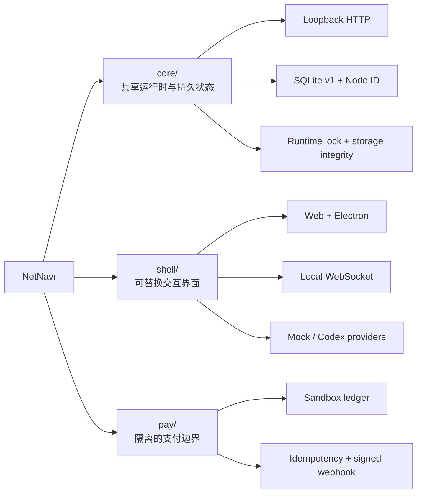

<div align="center">

# 🧭 NetNavr

**由用户掌控的个人 AI 连续性底座**

让身份、受治理记忆、权限与能力留在你控制的基础设施上；<br>
模型、服务商、设备与交互界面可以替换。

[](https://github.com/PM100Fun/netnavr/releases/latest)
[](https://github.com/PM100Fun/netnavr/actions/workflows/ci.yml)
[](#current-status)
[](./package.json)
[](./LICENSE)
[](https://github.com/PM100Fun/netnavr/stargazers)

**[项目定位](#positioning)** · **[当前能力](#capabilities)** · **[快速开始](#quick-start)** · **[技术架构](#architecture)** · **[路线图](#roadmap)** · **[English](#english)**

</div>

---

<a id="current-status"></a>

> [!WARNING]
> **Pre-alpha / Public Lab.** NetNavr 是可运行的早期研究原型，还不适合普通用户、重要数据、生产支付或不受信任的网络。本文把“已验证实现”和“产品目标”明确分开；没有被当前代码与测试证明的能力，不视为已经完成。

<a id="positioning"></a>

## ✨ 项目定位

NetNavr 想解决的不是“再做一个聊天窗口”，而是个人 AI 的**连续性与所有权**：当模型、供应商和设备变化时，属于用户的身份、记忆、权限和能力仍应保持可控、可迁移、可审计。

| 原则 | 含义 |
| :--- | :--- |
| 🏠 **用户所有** | 持久身份与数据应位于用户控制的基础设施，而不是绑定某一家模型服务商。 |
| 🔁 **智能可替换** | 模型与 Provider 是可替换的智能来源，不应成为个人 AI 状态的唯一持有者。 |
| 🧾 **治理优先** | 记忆需要来源、确认状态和明确权限；自动化能力必须受边界约束。 |
| 🧩 **能力可组合** | Tool、Connector、Skill 与 Plugin 最终应以统一的 Ability 契约被安装和调用。 |
| 🛡️ **高风险隔离** | 支付等高风险行为保持独立边界，不直接混入通用运行时。 |

> [!IMPORTANT]
> NetNavr 的第一项产品证明是“连续性”，不是功能数量：在用户掌控的 Node 上建立身份与受治理记忆，通过清晰权限调用一个低风险 Ability，切换智能 Provider 后状态仍然连续，并能完成隔离备份与恢复。

<a id="capabilities"></a>

## 🚦 当前可验证能力

| 模块 | 职责 | 当前实现 | 状态 |
| :--- | :--- | :--- | :---: |
| [`core/`](./core) | 共享运行时、持久状态与策略边界 | 仅监听回环地址；SQLite schema v1；持久 Node ID；数据目录单实例所有权；只读健康与 Node 接口 | ✅ `v0.2.0` |
| [`shell/`](./shell) | 可替换的人机交互界面 | Electron / React / TypeScript；本地 WebSocket 服务；会话令牌；Mock 与 Codex Provider 路由 | 🧪 原型 |
| [`pay/`](./pay) | 与通用运行时隔离的支付行为 | SQLite 沙盒订单账本；幂等创建；Sandbox Channel；签名 Webhook 测试 | 🧪 仅沙盒 |

<details>
<summary><b>📦 展开查看当前实现边界</b></summary>

### Core

- 为一次本地安装创建稳定、非秘密的 Node ID，并持久化到 SQLite；
- 通过 `GET /v1/health` 与 `GET /v1/node` 提供只读检查；
- 数据库损坏、迁移历史不一致、schema 版本过新或 Node ID 无效时均会失败关闭；
- 打开主数据库前取得独占运行时锁；同一规范化数据目录的竞争进程返回 `core_runtime_already_running`；
- 进程意外退出后由操作系统释放锁，不替换数据库或 Node ID；
- POSIX 系统上将数据目录限制为 `0700`，数据库、SQLite sidecar 与锁文件限制为 `0600`。

### Shell

- 包含 Web、Electron Desktop、本地 Agent Server、协议包、Model Router 与 Codex Client；
- 本地 WebSocket 会话由服务端控制工作区、sandbox 与 approval policy；
- `npm run dev` 会为服务端与 Web 端生成并共享新的本地会话令牌。

### Pay

- 只提供可测试的 Sandbox 支付纵切，不是生产支付基础设施；
- 与 Core 的通用运行时职责保持分离；
- Shell 与 Pay 默认都使用 `127.0.0.1:8787`，并行运行时必须修改 Pay 端口。

</details>

### 尚未完成

**Navigator 身份、受治理记忆、完整权限执行、Provider 切换后的状态连续性、设备配对、备份与恢复，以及公开 Ability 清单 / 沙盒 / 签名模型仍在设计或开发中。** Node ID 只是本地安装锚点，不是用户身份或认证凭据。

<a id="architecture"></a>

## 🏗️ 技术架构



| 层 | 技术选择 |
| :--- | :--- |
| **Core** | Node.js 24 · TypeScript · `node:http` · `node:sqlite` |
| **Shell** | Electron · React · Vite · TypeScript · WebSocket · OpenAI Codex SDK |
| **Pay** | Node.js 24 · SQLite · HMAC 签名 · 可插拔 Channel |
| **质量门禁** | `node:test` · TypeScript checks · GitHub Actions |

<a id="quick-start"></a>

## 🚀 快速开始

> 环境要求：Node.js 24 或更高版本 · npm

### 1. 获取代码并验证工作区

```bash
git clone https://github.com/PM100Fun/netnavr.git
cd netnavr
npm --prefix shell ci
npm run verify
```

### 2. 启动 Core

```bash
npm run dev:core
```

Core 默认只监听 `127.0.0.1:8786`。另开终端验证：

```bash
curl http://127.0.0.1:8786/v1/health
curl http://127.0.0.1:8786/v1/node
```

默认数据库位于 `~/.netnavr/core/core.sqlite`。使用隔离数据目录：

```bash
# macOS / Linux
NETNAVR_CORE_DATA_DIR=/absolute/path/to/data npm run dev:core
```

```powershell
# Windows PowerShell
$env:NETNAVR_CORE_DATA_DIR = "C:\path\to\isolated-data"
npm run dev:core
```

### 3. 启动 Shell

```bash
npm --prefix shell run dev
```

Shell 会启动本地 Agent Server 与 Web 界面。若分别启动服务端和 Web 端，请按 [`shell/.env.example`](./shell/.env.example) 为两端提供同一个新会话令牌。

### 4. 可选：启动 Pay 沙盒

Pay 与 Shell 默认端口相同。需要同时运行时，请给 Pay 分配另一个回环端口：

```bash
# macOS / Linux
NETNAVR_PAY_PORT=8788 npm --prefix pay start
```

```powershell
# Windows PowerShell
$env:NETNAVR_PAY_PORT = "8788"
npm --prefix pay start
```

> [!CAUTION]
> 当前开发接口尚未具备完整的应用级认证与权限系统。不要把 Core、Shell 或 Pay 服务暴露到公网。

## ⚙️ 常用配置

| 组件 | 配置项 | 默认值 | 用途 |
| :--- | :--- | :--- | :--- |
| Core | `NETNAVR_CORE_PORT` | `8786` | Core 回环端口 |
| Core | `NETNAVR_CORE_DATA_DIR` | `~/.netnavr/core` | Core 数据目录 |
| Shell | `PORT` | `8787` | 本地 Agent Server 端口 |
| Shell | `VITE_NETNAVR_SHELL_WS` | `ws://127.0.0.1:8787/ws` | Web 端本地 WebSocket 地址 |
| Pay | `NETNAVR_PAY_PORT` | `8787` | Pay 沙盒端口 |
| Pay | `NETNAVR_PAY_DB_PATH` | `./data/netnavr-pay.sqlite` | Pay 沙盒数据库 |

完整 Shell 与 Pay 示例分别见 [`shell/.env.example`](./shell/.env.example) 和 [`pay/.env.example`](./pay/.env.example)。

<a id="roadmap"></a>

## 🗺️ 连续性路线图

| 阶段 | 验证目标 | 状态 |
| :--- | :--- | :---: |
| **本地基础** | Loopback Core、SQLite v1、持久 Node ID、单实例存储与文件权限 | ✅ 已验证 |
| **交互原型** | Web / Electron Shell、本地认证 WebSocket、Mock / Codex Provider | 🧪 原型 |
| **身份与记忆** | Navigator 身份、带来源与确认状态的受治理记忆 | ⏳ 下一阶段 |
| **能力边界** | 一个低风险 Ability、明确权限、结构化结果 | ⬜ 未完成 |
| **连续性证明** | 切换 Provider 后身份与已确认记忆不丢失 | ⬜ 未完成 |
| **可恢复性** | 隔离备份、恢复与设备配对 | ⬜ 未完成 |
| **开放生态** | Ability manifest、sandbox、签名与第三方兼容契约 | ⬜ 设计中 |

路线图描述验证顺序，不构成发布日期承诺。

## 🤝 参与项目

NetNavr 现阶段最需要可复现的失败报告、小而聚焦的实验，以及对“用户所有权与可迁移性”模型的批评与建议。

- 提交代码前阅读 [CONTRIBUTING.md](./CONTRIBUTING.md)
- 项目治理方式见 [GOVERNANCE.md](./GOVERNANCE.md)
- 社区行为规范见 [CODE_OF_CONDUCT.md](./CODE_OF_CONDUCT.md)
- 不要在公开 Issue 中报告安全漏洞；私密报告方式见 [SECURITY.md](./SECURITY.md)
- 已发布版本见 [GitHub Releases](https://github.com/PM100Fun/netnavr/releases)

如果你认同“个人 AI 应该属于用户”，欢迎 Star、Issue 和聚焦的 Pull Request。

<a id="security"></a>

## 🔐 安全边界

- Core 固定监听本机回环地址；不要通过代理或端口转发把当前原型暴露到公网；
- Windows 当前依赖用户数据目录继承的 ACL，未来安装器仍需显式配置并验证仅当前用户可访问的 ACL；
- `pay/` 仅用于沙盒验证，不处理真实资金；
- 任何涉及重要数据、凭据或不可逆操作的集成都应等待权限模型完成。

<a id="english"></a>

## English

**NetNavr is a local-first continuity layer for personal AI.** It aims to keep identity, governed memory, permissions, and installed abilities on infrastructure controlled by the user while models, providers, devices, and interaction surfaces remain replaceable.

Today, the repository contains:

- a loopback-only Core with SQLite schema v1, a persistent local Node ID, single-owner runtime storage, and read-only health / Node endpoints;
- an Electron / React / TypeScript Shell with a local authenticated WebSocket server and Mock / Codex provider routing;
- an isolated payment sandbox with an idempotent SQLite ledger and signed webhook tests.

This is a **pre-alpha public lab**, not a production agent platform or payment system. Navigator identity, governed memory, permission enforcement, provider-switch continuity, pairing, backup / restore, and the public Ability contract are not complete. See [Quick start](#quick-start), [Security boundaries](#security), [CONTRIBUTING.md](./CONTRIBUTING.md), and [SECURITY.md](./SECURITY.md) before experimenting.

## 📄 License

Licensed under the [Apache License 2.0](./LICENSE). See [NOTICE](./NOTICE) for attribution information.
