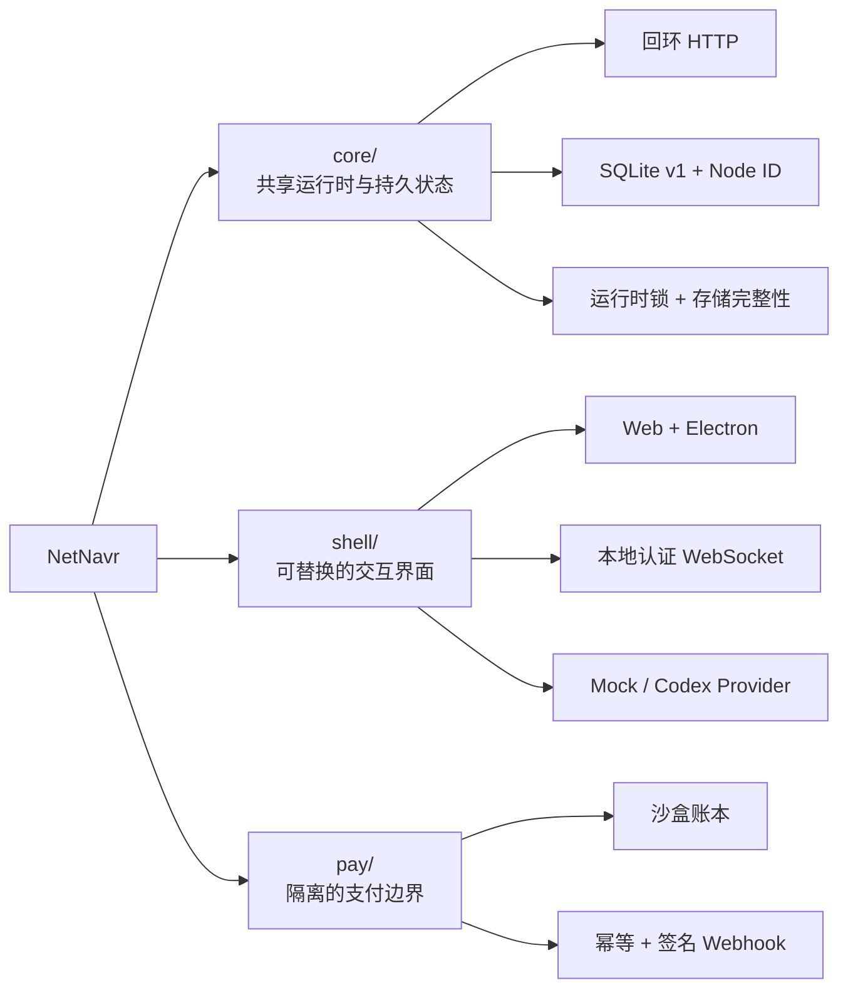

<div align="center">

# 🧭 NetNavr

[](#project-status)

**由用户掌控的个人 AI 连续性底座**

**让身份、受治理记忆、权限与能力始终在你的控制之下**

[](./LICENSE)
[](https://nodejs.org/)
[](https://www.typescriptlang.org/)
[](./shell)
[](#project-status)
[](https://github.com/PM100Fun/NetNavr/releases/latest)
[](https://github.com/PM100Fun/NetNavr/actions/workflows/ci.yml)
[](https://github.com/PM100Fun/NetNavr/stargazers)

**[English](./README.md)** · **简体中文**

**[快速开始](#quick-start)** · **[当前能力](#capabilities)** · **[技术架构](#architecture)** · **[路线图](#roadmap)**

</div>

---

<a id="project-status"></a>

**NetNavr 是独立开源的 Pre-alpha 公共实验项目，不是生产级 Agent 平台或支付系统。**

> ⚠️ 本仓库提供的是用于探索个人 AI 连续性的本地工程原型。请勿用于重要数据、真实资金、不受信任的网络或生产工作负载。
>
> **尚未交付：** Navigator 身份、受治理记忆、完整权限执行、切换 Provider 后的连续性、设备配对、备份恢复，以及公开的 Ability 安全模型。

欢迎通过 [GitHub Issues](https://github.com/PM100Fun/NetNavr/issues) 提问和反馈。如果你认同这个方向，也欢迎给项目一个 Star。

---

<a id="positioning"></a>

## ✨ 项目定位

NetNavr 想解决的不是“再做一个聊天窗口”，而是个人 AI 的连续性：当模型、服务商、设备与交互界面发生变化时，属于用户的身份、受治理记忆、权限和已安装能力仍然可控、可迁移、可审计。

| 原则 | 含义 |
| :--- | :--- |
| 🏠 **用户所有** | 持久身份与数据应位于用户控制的基础设施上，而不是绑定在单一模型服务商内部。 |
| 🔁 **智能可替换** | 模型与 Provider 是可以替换的智能来源，不应成为个人 AI 状态的唯一持有者。 |
| 🧠 **治理优先** | 记忆需要来源和确认状态；自动化需要明确的权限边界。 |
| 🧩 **能力可组合** | Tool、Connector、Skill 与 Plugin 最终应收敛到一致的 Ability 契约。 |
| 🛡️ **高风险隔离** | 支付等高风险行为保持在通用运行时边界之外。 |

> [!IMPORTANT]
> 第一项产品证明是连续性，而不是功能数量：在用户掌控的 Node 上建立身份与受治理记忆，通过明确权限调用一个低风险 Ability，切换智能 Provider 后状态仍然连续，并能完成隔离备份与恢复。

<a id="capabilities"></a>

## 🚧 当前可验证能力

下表只描述当前源码树中可以检查的实现；尚未实现的产品目标单独列出。

| 模块 | 职责 | 当前实现 | 状态 |
| :--- | :--- | :--- | :---: |
| [`core/`](./core) | 共享运行时、持久状态与策略边界 | 仅监听回环地址；SQLite schema v1；持久 Node ID；数据目录单实例所有权；只读健康与 Node 接口 | ✅ `v0.2.0` |
| [`shell/`](./shell) | 可替换的人机交互界面 | Electron / React / TypeScript；认证回环 WebSocket；沙盒化 Preload 凭据桥；Mock 与 Codex 路由 | 🚧 原型 |
| [`pay/`](./pay) | 与通用运行时隔离的支付行为 | SQLite 沙盒账本；幂等创建；Sandbox Channel；事件绑定的签名 Webhook | 🧪 仅沙盒 |

<details>
<summary><b>📦 当前实现边界</b></summary>

### Core

- 为一次本地安装创建稳定、非秘密的 Node ID，并持久化到 SQLite。
- 通过 `GET /v1/health` 与 `GET /v1/node` 提供只读检查。
- 数据库损坏、迁移历史不一致、schema 版本过新或 Node ID 无效时均会失败关闭。
- 打开主数据库前取得独占运行时锁。
- 进程意外退出后保留数据库与 Node ID。
- 在 POSIX 系统上为数据目录、数据库、sidecar 与锁文件设置限制性权限。

### Shell

- 包含 Web、Electron Desktop、本地 Agent Server、协议、Model Router 与 Codex Client。
- 本地 WebSocket 会话中的工作区、sandbox 与 approval policy 由服务端控制。
- 使用 `npm run dev` 时，为服务端与 Web 客户端生成并共享新的本地会话令牌。
- Electron 自有 Agent Server 使用操作系统分配的回环端口，并通过 context-isolated、sandboxed Preload 桥传递临时连接信息，不再写入 Renderer URL。
- Renderer 使用限制性 CSP，且只有不含凭据的 HTTPS 外链可以交给操作系统打开。
- 目前仍是 macOS 优先的交互原型；其他桌面平台尚未达到发布验证标准。

### Pay

- 仅提供可测试的支付沙盒，不是生产支付基础设施。
- 与 Core 的通用运行时职责保持隔离。
- 仅接受数字回环地址 `127.0.0.1`，并默认使用端口 `8788`，与 Shell 分离。
- 每个 Webhook 事件 ID 都绑定其原始类型、Channel 与订单；冲突复用会按失败关闭处理。

</details>

### 尚未完成

**Navigator 身份、受治理记忆、完整权限执行、Provider 切换后的连续性、设备配对、备份恢复，以及公开的 Ability manifest / sandbox / 签名模型仍在设计或开发中。** Node ID 只是本地安装锚点，不是用户身份或认证凭据。

<a id="architecture"></a>

## 🏗️ 技术架构



| 层 | 当前技术选择 |
| :--- | :--- |
| **Core** | Node.js 24 · TypeScript · `node:http` · `node:sqlite` |
| **Shell** | Electron · React · Vite · TypeScript · WebSocket · OpenAI Codex SDK |
| **Pay** | Node.js 24 · SQLite · HMAC 签名 · 可插拔 Channel |
| **质量门禁** | `node:test` · TypeScript checks · GitHub Actions |

<a id="quick-start"></a>

## 🚀 快速开始

> 环境要求：Node.js 24 或更高版本，以及 npm。

### 1. 获取代码并验证

```bash
git clone https://github.com/PM100Fun/NetNavr.git
cd NetNavr
npm --prefix shell ci
npm run verify
```

### 2. 启动 Core

```bash
npm run dev:core
```

Core 默认只监听 `127.0.0.1:8786`。在另一个终端中验证：

```bash
curl http://127.0.0.1:8786/v1/health
curl http://127.0.0.1:8786/v1/node
```

默认数据库位于 `~/.netnavr/core/core.sqlite`。如需使用隔离的数据目录：

```bash
# macOS / Linux
NETNAVR_CORE_DATA_DIR=/absolute/path/to/data npm run dev:core
```

```powershell
# Windows PowerShell
$env:NETNAVR_CORE_DATA_DIR = "C:\path\to\isolated-data"
npm run dev:core
```

### 3. 启动 Shell

```bash
npm --prefix shell run dev
```

该命令会启动本地 Agent Server 与 Web 界面。如果分别启动服务端和 Web 客户端，请按照 [`shell/.env.example`](./shell/.env.example) 为两端提供同一个新的令牌。

### 4. 可选：启动 Pay 沙盒

Pay 默认使用 `127.0.0.1:8788`，无需修改端口即可与 Shell 同时运行：

```bash
npm --prefix pay start
```

> [!CAUTION]
> 当前开发接口尚未提供完整的应用级认证和授权系统。不要把 Core、Shell 或 Pay 暴露到公网。

## ⚙️ 常用配置

| 组件 | 配置项 | 默认值 | 用途 |
| :--- | :--- | :--- | :--- |
| Core | `NETNAVR_CORE_PORT` | `8786` | Core 回环端口 |
| Core | `NETNAVR_CORE_DATA_DIR` | `~/.netnavr/core` | Core 数据目录 |
| Shell | `PORT` | `8787` | 独立开发 Agent Server 端口；Electron 使用操作系统分配端口 |
| Shell | `VITE_NETNAVR_SHELL_WS` | `ws://127.0.0.1:8787/ws` | 独立开发 Web 客户端 WebSocket 地址 |
| Pay | `NETNAVR_PAY_HOST` | `127.0.0.1` | 固定的数字回环地址；其他值会被拒绝 |
| Pay | `NETNAVR_PAY_PORT` | `8788` | Pay 沙盒端口 |
| Pay | `NETNAVR_PAY_DB_PATH` | `./data/netnavr-pay.sqlite` | Pay 沙盒数据库 |

当前示例见 [`shell/.env.example`](./shell/.env.example) 与 [`pay/.env.example`](./pay/.env.example)。

<a id="roadmap"></a>

## 🗺️ 连续性路线图

| 阶段 | 验证目标 | 状态 |
| :--- | :--- | :---: |
| **本地基础** | 回环 Core、SQLite v1、持久 Node ID、单实例存储与限制性文件权限 | ✅ 已验证 |
| **交互原型** | Web / Electron Shell、本地认证 WebSocket、Mock / Codex Provider 路由 | 🚧 原型 |
| **身份与记忆** | Navigator 身份、带来源与确认状态的受治理记忆 | ⏭️ 下一阶段 |
| **能力边界** | 一个低风险 Ability、明确权限与结构化结果 | ⬜ 未完成 |
| **连续性证明** | 切换 Provider 后身份与已确认记忆不丢失 | ⬜ 未完成 |
| **可恢复性** | 隔离备份、恢复与设备配对 | ⬜ 未完成 |
| **开放生态** | Ability manifest、sandbox、签名与第三方兼容契约 | ⬜ 设计中 |

路线图描述验证顺序，不构成发布日期承诺。

## 🤝 参与项目

NetNavr 现阶段最需要可复现的故障报告、小而聚焦的实验，以及对“用户所有权与可迁移性”模型的批评和建议。

- 提交代码前阅读 [CONTRIBUTING.md](./CONTRIBUTING.md)。
- 项目治理方式见 [GOVERNANCE.md](./GOVERNANCE.md)。
- 在社区空间遵循 [CODE_OF_CONDUCT.md](./CODE_OF_CONDUCT.md)。
- 不要在公开 Issue 中报告安全漏洞；私密报告方式见 [SECURITY.md](./SECURITY.md)。
- 已发布版本见 [GitHub Releases](https://github.com/PM100Fun/NetNavr/releases)。

<a id="security"></a>

## 🔐 安全边界

- Core 固定监听本机回环地址；不要通过代理或端口转发把当前原型暴露到公网。
- Windows 当前依赖用户数据目录继承的 ACL；未来安装器仍需显式配置并验证只有当前用户可访问的 ACL。
- `pay/` 仅用于沙盒验证，不得处理真实资金。
- 任何涉及重要数据、凭据或不可逆操作的集成都应等待权限模型完成。

## 📄 许可证

本项目采用 [Apache License 2.0](./LICENSE)；归属信息见 [NOTICE](./NOTICE)。
